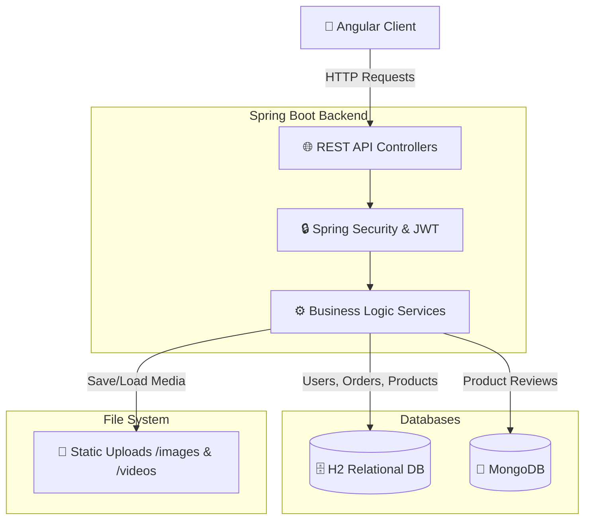
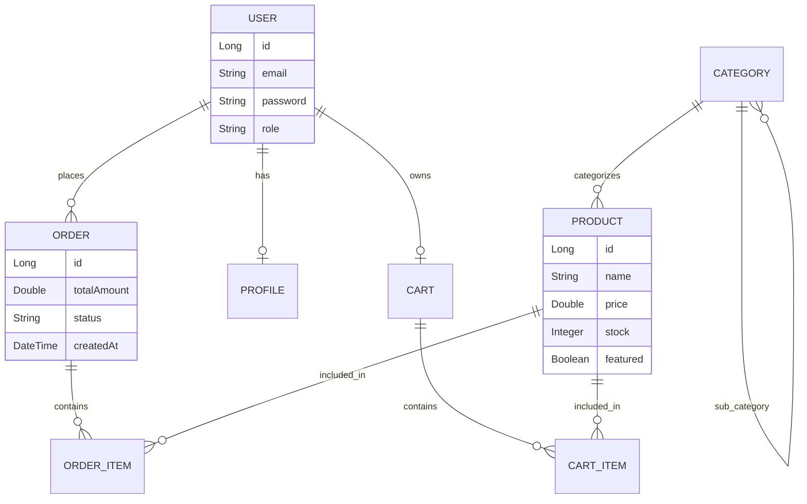

<div align="center">
  <h1>🛒 E-Store Premium Platform</h1>
  <p>A Full-Stack, High-Performance E-Commerce Platform for Modern Electronics</p>

  <!-- Badges -->
  
  
  
  
  
</div>

<br />

## 🚀 Overview
E-Store is a complete end-to-end e-commerce solution built for selling premium electronics. It features a robust **Spring Boot** backend using **JPA (H2)** for transactional data and **MongoDB** for document storage (reviews), seamlessly connected to a dynamic, responsive **Angular 19** frontend.

### ✨ Key Features
- **Premium Product Catalog**: Supports multiple image galleries, video previews, and real-time stock tracking.
- **Secure Authentication**: Stateless JWT-based authentication.
- **Shopping Cart & Checkout**: Live cart calculations and strict stock validation during order placement.
- **Admin Dashboard**: Full CRUD management with drag-and-drop file uploads for media assets.
- **Rich User Feedback**: MongoDB-backed product review and rating system.

---

## 🏗️ System Architecture

The application follows a clean, decoupled architecture:



---

## 🗃️ Database Entity Relationship



---

## 🛠️ Quick Start Guide

<details>
<summary><b>1. Start the Database (MongoDB)</b></summary>

Make sure MongoDB is running on your local machine (default port `27017`).
```bash
mongod
```
</details>

<details>
<summary><b>2. Run the Spring Boot Backend</b></summary>

```bash
cd backend

# (Optional) Set JWT secret for production
export JWT_SECRET=$(openssl rand -hex 32)

# Build and run
mvn spring-boot:run
```
*Backend runs on `http://localhost:8080`.*
</details>

<details>
<summary><b>3. Run the Angular Frontend</b></summary>

```bash
cd frontend

# Install dependencies
npm install

# Start development server
npm start
```
*Frontend runs on `http://localhost:4200`.*
</details>

---

## 🔐 Default Test Accounts

The backend automatically seeds a premium catalog and the following test accounts:

| Role | Email | Password |
|:---|:---|:---|
| 👑 **Admin** | `admin@estore.com` | `admin123` |
| 👤 **User** | `omar@test.com` | `user123` |
| 👤 **User** | `fatima@test.com` | `user123` |

---

## 📡 API Endpoints

<details>
<summary><b>Authentication & Users</b></summary>

| Method | Endpoint | Description |
|:---|:---|:---|
| `POST` | `/api/auth/register` | Create a new user account |
| `POST` | `/api/auth/login` | Login and receive a JWT token |
</details>

<details>
<summary><b>Catalog & Products</b></summary>

| Method | Endpoint | Description |
|:---|:---|:---|
| `GET` | `/api/products/page` | Get paginated and filtered products |
| `GET` | `/api/products/{id}` | Get product details by ID |
| `GET` | `/api/categories` | List all categories and sub-categories |
</details>

<details>
<summary><b>Shopping Cart & Orders</b></summary>

| Method | Endpoint | Description |
|:---|:---|:---|
| `POST` | `/api/cart/add` | Add an item to the shopping cart |
| `POST` | `/api/orders` | Place an order from current cart |
| `GET` | `/api/orders/user/{id}` | Get order history for user |
</details>

<details>
<summary><b>Admin Management</b></summary>

| Method | Endpoint | Description |
|:---|:---|:---|
| `POST` | `/api/admin/products/upload`| Create product with file uploads |
| `PATCH`| `/api/admin/products/{id}/featured` | Toggle product featured status |
| `PUT` | `/api/admin/inventory/{id}` | Update product stock levels |
</details>

---

## 📸 Media Storage & File Uploads

Product images and videos uploaded via the Admin Panel are saved locally inside the `backend/src/main/resources/static/uploads/` directory.

- **Images**: Served statically at `/uploads/images/`
- **Videos**: Served statically at `/uploads/videos/`

> **Note**: To prevent massive repository bloat, user-uploaded media files should be added to `.gitignore` before pushing to a remote repository!
